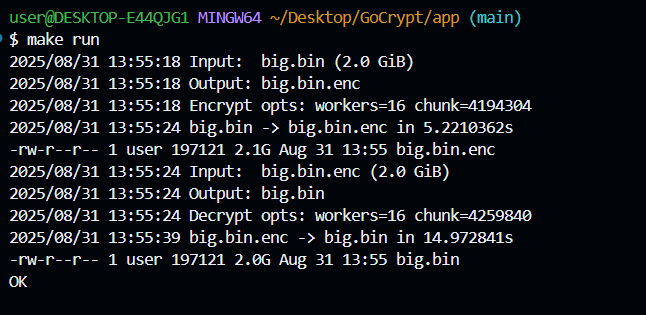

# GoCrypt - Fast and Secure File Encryption

This is a high-performance file encryption tool written in Go. It encrypts files in parallel using AES-GCM, derives keys with Argon2id, and authenticates everything with a final HMAC-SHA256 tag for full-file integrity.

---

## How It Works

1. **Header** – Contains salt, nonce base, chunk size.
2. **Key Derivation** – Password is expanded into a 256-bit key using Argon2id.
3. **Encryption** – File is split into chunks, each encrypted with AES-GCM:

   - Nonce = `NonceBase || chunk_index`
   - AAD = `SHA256(headerRaw) || chunk_index || ciphertext_length`

4. **Authentication** – Each `(len || ciphertext)` is streamed into an HMAC.
5. **Trailer** – Final HMAC tag is written at the end for global integrity.

---

## Tech Stack

- **Language**: Go (Golang)
- **Crypto**: AES-GCM, Argon2id, HMAC-SHA256
- **Concurrency**: Goroutines, worker pools

---

## Security Guarantees

- AES-GCM provides confidentiality and per-chunk authenticity
- Final HMAC provides whole-file integrity against truncation/reordering
- Argon2id makes password cracking infeasible
- Nonce wrapping is detected and prevented

---

## Example Encryption/Decryption

